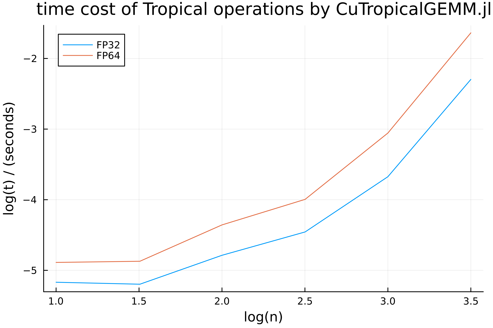

# CuTropicalGEMM

[](https://github.com/ArrogantGao/CuTropicalGEMM.jl/actions/workflows/CI.yml?query=branch%3Amain)
[](https://travis-ci.com/ArrogantGao/CuTropicalGEMM.jl)
[](https://codecov.io/gh/ArrogantGao/CuTropicalGEMM.jl)

CuTropicalGEMM is a fast Tropical matrix multiplication on Nvidia GPU. Supported matrix element types include
* and-or algebra: `TropicalAndOr`
* max-plus algebra: `Tropical{Float32/Float64}`
* min-plus algebra numbers: `TropicalMinPlus{Float32/Float64}`
* max-times algebra numbers: `TropicalMaxMul{Float32/Float64/Int32/Int64}`

Please check [`TropicalNumbers.jl`](https://github.com/TensorBFS/TropicalNumbers.jl) for the definitions of these types. 

## Get started

Open a Julia REPL and type `]` to enter the `pkg>` mode, and then install related packages with
```julia
pkg> add CuTropicalGEMM, BenchmarkTools, TropicalNumbers, CUDA
pkg> build
```
Loading `CuTropicalGEMM` module into the workspace affects the `*` and `LinearAlgebra.mul!` on CuTropical matrices immediately. The following is a minimum working example
```julia
julia> using TropicalNumbers, CUDA, BenchmarkTools, LinearAlgebra

julia> a = Tropical.(CUDA.randn(4096, 4096));

julia> @benchmark CUDA.@sync $a * $a
BenchmarkTools.Trial: 44 samples with 1 evaluation.
 Range (min … max):  108.365 ms … 123.031 ms  ┊ GC (min … max): 0.00% … 0.00%
 Time  (median):     116.051 ms               ┊ GC (median):    0.00%
 Time  (mean ± σ):   116.289 ms ±   4.390 ms  ┊ GC (mean ± σ):  0.00% ± 0.00%

             ▁▁       ▁▁                     ▁     ▄ ▁  ▁█       
  ▆▁▁▁▁▁▆▆▆▆▆██▁▆▁▁▆▁▆██▁▁▆▁▆▆▆▁▁▆▆▁▁▁▁▆▆▁▁▁▁█▆▆▁▁▁█▆█▆▆██▁▁▁▁▆ ▁
  108 ms           Histogram: frequency by time          123 ms <

 Memory estimate: 5.03 KiB, allocs estimate: 95.

julia> using CuTropicalGEMM

julia> @benchmark CUDA.@sync $a * $a
BenchmarkTools.Trial: 440 samples with 1 evaluation.
 Range (min … max):   8.920 μs … 24.497 ms  ┊ GC (min … max): 0.00% … 0.00%
 Time  (median):     10.733 ms              ┊ GC (median):    0.00%
 Time  (mean ± σ):   11.363 ms ± 11.347 ms  ┊ GC (mean ± σ):  0.00% ± 0.00%

  █                                                       ▅▇▂  
  █▅▁▁▁▁▁▁▁▁▁▁▁▁▁▁▁▁▁▁▁▁▁▁▁▁▁▁▁▁▁▁▁▁▁▁▁▁▁▁▁▁▁▁▁▁▁▁▁▁▁▁▄▁▄▄███ ▆
  8.92 μs      Histogram: log(frequency) by time      23.3 ms <

 Memory estimate: 160 bytes, allocs estimate: 4.

 julia> o = Tropical.(CUDA.zeros(4096, 4096));

julia> @benchmark CUDA.@sync LinearAlgebra.mul!($o, $a, $a)
BenchmarkTools.Trial: 70 samples with 7 evaluations.
 Range (min … max):   4.232 μs … 11.490 ms  ┊ GC (min … max): 0.00% … 0.00%
 Time  (median):     11.459 ms              ┊ GC (median):    0.00%
 Time  (mean ± σ):   10.349 ms ±  3.337 ms  ┊ GC (mean ± σ):  0.00% ± 0.00%

                                                            █  
  ▃▁▁▁▁▁▁▁▁▁▁▁▁▁▁▁▂▁▁▁▁▁▁▁▁▁▁▁▁▁▁▁▁▁▁▁▁▁▁▁▁▁▁▁▁▁▁▁▁▁▁▁▁▁▁▁▁▁█ ▁
  4.23 μs         Histogram: frequency by time        11.5 ms <

 Memory estimate: 0 bytes, allocs estimate: 0.
```

## Benchmarks

Matrix size `n x n`, NVIDIA A800 80GB PCIe.
The benchmark and plotting scripts could be found in the benchmarks folder.



For matrix size large enough ($n > 3000$), the computation power is about $13$ TFlops for FP32 operations and $3$ TFlops for FP64 operations.

## References
1. This package originates from the following issue:
https://github.com/JuliaSIMD/LoopVectorization.jl/issues/201
2. When writing our CUDA C package, we referenced the repository https://github.com/Cjkkkk/CUDA_gemm.
